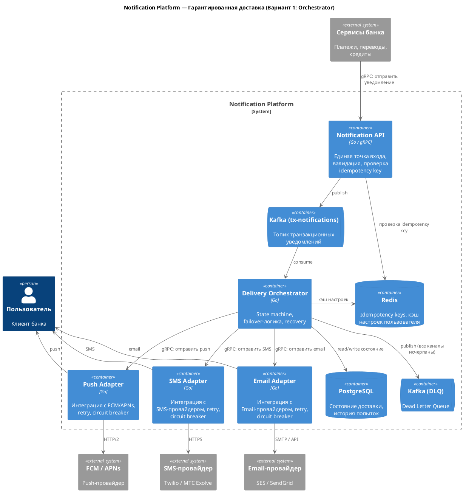
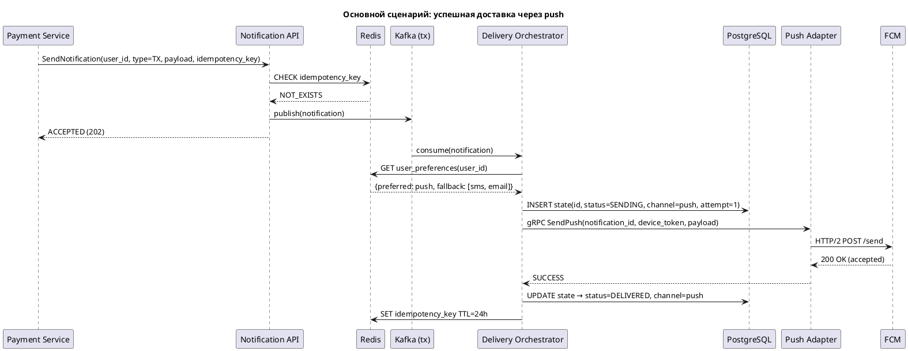
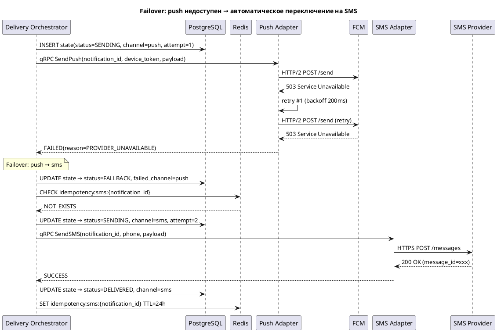
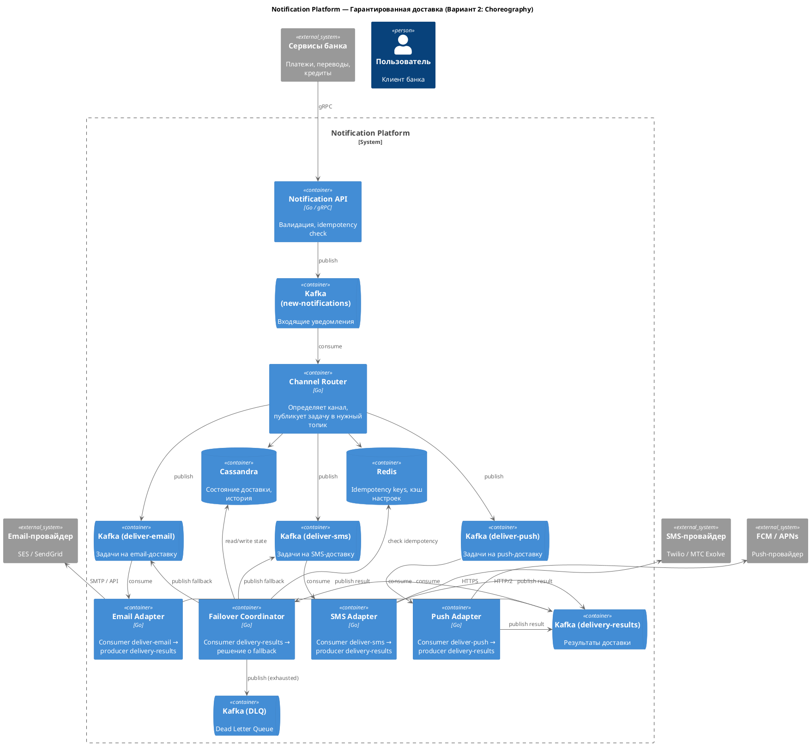
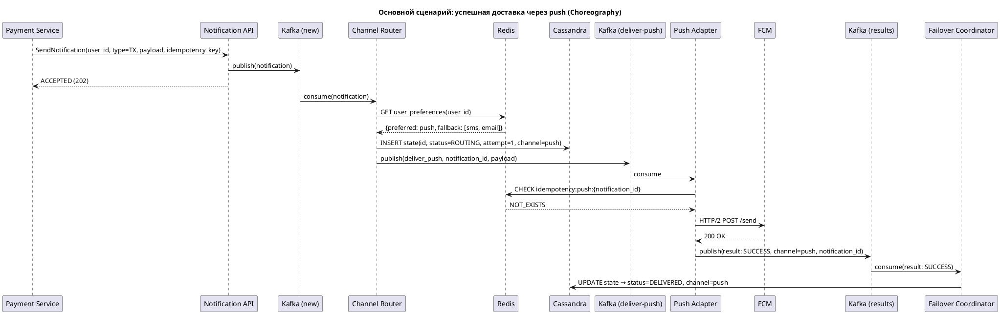
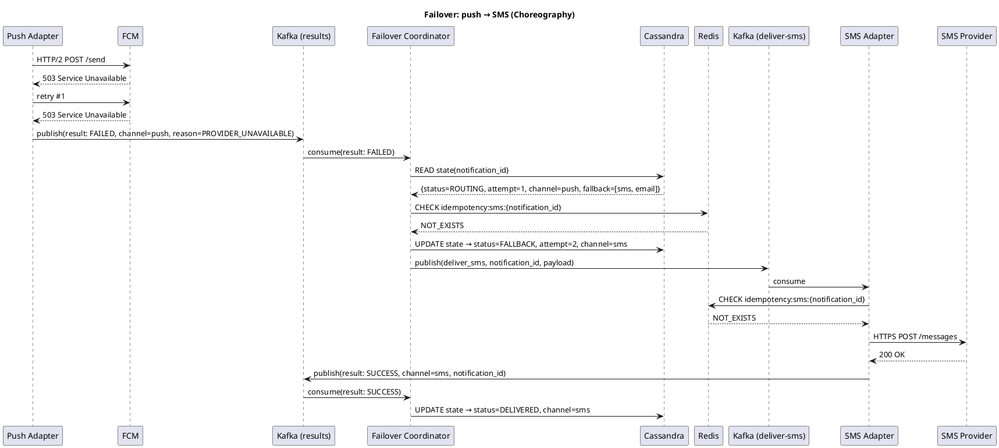

# RFC: Гарантированная доставка критичных уведомлений с кросс-канальным failover

| Метаданные | Значение |
|------------|----------|
| **Статус** | DRAFT |
| **Автор(ы)** | — |
| **Ответственный** | — |
| **Бизнес-заказчик** | Руководитель направления клиентских коммуникаций |
| **Ревьюеры** | — |
| **Дата создания** | 2026-04-07 |
| **Дата обновления** | 2026-04-07 |

---

## Оглавление

1. [Контекст](#контекст)
2. [Продуктовый анализ](#продуктовый-анализ)
3. [Пользовательские сценарии](#пользовательские-сценарии)
4. [Статистика и расчёт нагрузки](#статистика-и-расчёт-нагрузки)
5. [Требования](#требования)
6. [Варианты решения](#варианты-решения)
7. [Сравнительный анализ](#сравнительный-анализ)
8. [Выводы](#выводы)
9. [Связанные задачи](#связанные-задачи)
10. [Приложения](#приложения)

---

## Контекст

Компания развивает онлайн-банк с 10 млн MAU. Транзакционные уведомления (подтверждение перевода, списание средств, вход в аккаунт) являются критичными — их недоставка напрямую влияет на пользовательский опыт и безопасность.

Сейчас каждая продуктовая команда отправляет уведомления самостоятельно через разные интеграции с провайдерами. Это приводит к:

- **Задержкам доставки** — нет единого приоритетного пути для критичных уведомлений.
- **Дублированию** — при retry повторные уведомления раздражают пользователей.
- **Отсутствию failover** — если push-провайдер недоступен, уведомление просто теряется.
- **Слепым зонам** — нет единого мониторинга, невозможно понять delivery rate по каналам.

В рамках создания централизованной Notification Platform данный RFC описывает проектирование подсистемы гарантированной доставки транзакционных уведомлений с автоматическим кросс-канальным failover.

### Ключевые вопросы

- **Какую проблему мы решаем?** Отсутствие гарантий доставки критичных уведомлений. При сбое push-провайдера уведомление о списании средств может не дойти до пользователя.
- **Почему это важно сейчас?** Количество жалоб на недоставленные уведомления растёт; бизнес-цель — снизить жалобы на 30% и обеспечить delivery rate ≥ 99.99% для транзакционных сообщений.
- **Кто затронут этим изменением?** Все продуктовые команды, отправляющие транзакционные уведомления (платежи, переводы, кредиты, безопасность); команда эксплуатации; конечные пользователи банка.

---

## Продуктовый анализ

Каждый канал доставки имеет свой профиль надёжности и стоимости:

| Канал | Типичная латентность | Надёжность | Стоимость | Особенности |
|-------|---------------------|------------|-----------|-------------|
| Push (FCM/APNs) | 0.1–1 с | Средняя (~90–95% до устройства) | Бесплатно | Нет гарантии доставки до устройства; не работает без приложения и при выключенном телефоне |
| SMS | 1–5 с | Высокая (~98–99%) | ~2–4 руб./SMS | Работает без интернета; дорого при масштабе |
| Email | 5–30 с | Средняя (~95%, spam-фильтры) | ~0.01–0.05 руб./письмо | Не для срочных уведомлений; может попасть в спам |

**Вывод:** ни один канал не обеспечивает 99.99% надёжности в одиночку. Гарантированная доставка возможна только через комбинацию каналов с автоматическим failover.

**Влияние на бизнес-метрики:**
- Delivery rate транзакционных уведомлений: текущий ~92–95% → целевой ≥ 99.99%.
- Снижение жалоб на уведомления на 30%.
- Рост retention за счёт повышения доверия к банку (пользователь всегда в курсе своих операций).

---

## Пользовательские сценарии

| Приоритет | Тип сценария | Действующее лицо | Сценарий |
|-----------|--------------|-------------------|----------|
| MUST HAVE | Доставка | Сервис платежей | Отправляет транзакционное уведомление о списании средств. Пользователь получает push на телефон в течение 1 секунды |
| MUST HAVE | Failover | Система | Push-провайдер возвращает ошибку. Система автоматически переключается на SMS, пользователь получает сообщение через резервный канал |
| MUST HAVE | Failover (полный) | Система / Дежурный инженер | Все каналы доставки исчерпаны. Уведомление попадает в Dead Letter Queue. Дежурный инженер получает алерт и разбирает инцидент |
| MUST HAVE | Дедупликация | Система | При failover с push на SMS пользователь не получает одно и то же уведомление дважды по одному каналу |
| SHOULD HAVE | Настройки | Пользователь | Меняет предпочтительный канал доставки транзакционных уведомлений с push на SMS в настройках приложения. Система учитывает этот выбор при следующей отправке |
| SHOULD HAVE | Мониторинг | Дежурный инженер | Открывает дашборд и видит в реальном времени delivery rate, latency и failover rate по каждому каналу. При деградации срабатывает алерт |
| SHOULD HAVE | Recovery | Система | После рестарта сервиса система обнаруживает уведомления, застрявшие в статусе SENDING, и автоматически возобновляет их обработку |
| COULD HAVE | Circuit Breaker | Система | При массовом сбое провайдера (>50% ошибок за 30 с) система пропускает этот канал для последующих уведомлений, не дожидаясь таймаута |
| COULD HAVE | Аналитика | Продакт-менеджер | Выгружает статистику доставки по каналам за месяц для оптимизации расходов на SMS |

---

## Статистика и расчёт нагрузки

### Исходные данные

| Параметр | Значение |
|----------|----------|
| MAU | 10 000 000 |
| DAU | 3 000 000 |
| Peak Concurrent Users | 300 000 |
| Транзакционных уведомлений на пользователя в день | 2 |
| **Итого транзакционных уведомлений в день** | **6 000 000** |

### RPS

| Метрика | Расчёт | Значение |
|---------|--------|----------|
| Средний RPS | 6 000 000 / 86 400 | **~70 RPS** |
| Пиковый RPS (60% за 8 ч) | 3 600 000 / 28 800 | **~125 RPS** |
| Пиковый RPS (день зарплаты, ×5) | 125 × 5 | **~625 RPS** |
| **Проектная мощность (с запасом)** | | **1 000 RPS** |

### С учётом failover

| Параметр | Значение |
|----------|----------|
| Доставлено с первой попытки | ~95% |
| Fallback на второй канал | ~5% |
| Fallback на третий канал | ~0.5% |
| Фактический RPS к канальным адаптерам | 1 000 × 1.055 ≈ **1 055 RPS** |

### Хранение

| Параметр | Расчёт | Значение |
|----------|--------|----------|
| Размер записи состояния | — | ~500 байт |
| Объём в день | 6 000 000 × 500 B | **~3 ГБ** |
| Хранение 90 дней | 3 ГБ × 90 | **~270 ГБ** |
| Kafka throughput | 1 000 RPS × ~1 КБ | **~1 МБ/с** |

**Вывод:** нагрузка умеренная. PostgreSQL на одном инстансе (с репликой) справляется с хранением. Kafka-нагрузка тривиальна. Сложная инфраструктура (шардирование, NoSQL) на данном этапе не требуется.

---

## Требования

### Функциональные требования

> За основу взяты FR из общих требований к Notification Platform (задания 1–3), детализированные для подсистемы гарантированной доставки.

| № | Приоритет | Обозначение | Требование |
|---|-----------|-------------|------------|
| 1 | MUST HAVE | FR1 | Система принимает транзакционное уведомление и гарантирует его доставку хотя бы через один канал (push, SMS, email) |
| 2 | MUST HAVE | FR2 | При неуспешной доставке по текущему каналу система автоматически переключается на следующий по цепочке приоритетов |
| 3 | MUST HAVE | FR3 | Порядок каналов по умолчанию: push → SMS → email. Пользователь может изменить предпочтительный канал, но не может отключить транзакционные уведомления полностью |
| 4 | MUST HAVE | FR4 | При failover уведомление не дублируется: пользователь получает не более одного сообщения по каждому каналу за одну попытку доставки |
| 5 | MUST HAVE | FR5 | Система фиксирует статус доставки каждого уведомления по каждому каналу (CREATED → SENDING → DELIVERED / FAILED → FALLBACK → ...) |
| 6 | SHOULD HAVE | FR6 | Уведомления, исчерпавшие все каналы, попадают в Dead Letter Queue с алертом для дежурной команды |
| 7 | SHOULD HAVE | FR7 | Система учитывает доступность каналов для пользователя (например, нет установленного приложения → пропуск push) |
| 8 | COULD HAVE | FR8 | Circuit Breaker: при массовом сбое провайдера — автоматический пропуск канала без ожидания таймаута |

### Нефункциональные требования

| № | Приоритет | Обозначение | Требование | Метрика |
|---|-----------|-------------|------------|---------|
| 1 | MUST HAVE | NFR1 | Задержка доставки транзакционных уведомлений | ≤ 1 с от приёма до передачи провайдеру (p99) |
| 2 | MUST HAVE | NFR2 | Надёжность доставки (delivery rate) | ≥ 99.99% (потеря ≤ 1 из 10 000) |
| 3 | MUST HAVE | NFR3 | Доступность подсистемы | ≥ 99.99% (~4 мин простоя в месяц) |
| 4 | MUST HAVE | NFR4 | Дедупликация при failover | 0 дублей в штатном режиме |
| 5 | MUST HAVE | NFR5 | Пропускная способность | ≥ 1 000 RPS (проектная мощность) |
| 6 | SHOULD HAVE | NFR6 | Наблюдаемость | Трассировка каждого уведомления end-to-end; дашборд с delivery rate, latency, failover rate в реальном времени; алерт при delivery rate < 99.9% |
| 7 | SHOULD HAVE | NFR7 | Время восстановления после сбоя | Автоматический recovery за ≤ 30 с, без потери in-flight уведомлений |

### Архитектурно значимые требования (ASR)

> ASR — требования, которые напрямую влияют на выбор архитектуры.

**ASR-1. Низкая задержка доставки (≤ 1 с p99)**

- **Приоритет:** Критический.
- **Связанные требования:** NFR1, NFR5.
- **Влияние:** Требует выделенного fast-path для транзакционных уведомлений с минимумом I/O-операций. Запрещает использование общей очереди с маркетинговым/сервисным трафиком. Определяет необходимость кэширования настроек пользователя и pre-established connections к провайдерам.

**ASR-2. Гарантированная доставка с failover (≥ 99.99%)**

- **Приоритет:** Критический.
- **Связанные требования:** FR1, FR2, NFR2, NFR3, NFR7.
- **Влияние:** Требует персистентного хранения состояния доставки (state machine). Определяет механизм таймаутов и автоматического failover. Вводит необходимость transactional messaging (Outbox Pattern или аналог) для гарантии консистентности между БД и брокером. Требует механизма recovery для уведомлений, застрявших в промежуточном состоянии.

**ASR-3. Предотвращение дублирования при failover**

- **Приоритет:** Высокий.
- **Связанные требования:** FR4, NFR4.
- **Влияние:** Требует idempotency на уровне API (входящий idempotency key) и на уровне канальных адаптеров (per-channel idempotency key). Определяет необходимость проверки текущего состояния перед каждой попыткой отправки.

**ASR-4. Наблюдаемость процесса доставки**

- **Приоритет:** Высокий.
- **Связанные требования:** FR5, NFR6.
- **Влияние:** Требует structured logging, distributed tracing (correlation ID сквозь все компоненты) и метрик на каждом переходе state machine. Влияет на формат межсервисных сообщений (обязательные trace-заголовки).

---

## Варианты решения

### Вариант 1: Централизованный оркестратор (Orchestration)

> **Описание:** Центральный сервис Delivery Orchestrator управляет жизненным циклом каждого уведомления через конечный автомат (state machine). Оркестратор последовательно пробует каналы по приоритету и принимает решение о failover. Канальные адаптеры — отдельные микросервисы, вызываемые синхронно через gRPC.

#### Технологии

| Компонент | Технология | Обоснование |
|-----------|------------|-------------|
| Брокер сообщений | Apache Kafka | At-least-once delivery, партиционирование, высокая пропускная способность |
| Хранилище состояния | PostgreSQL | ACID-гарантии, удобство отладки, достаточный write throughput для 1K RPS |
| Кэш | Redis | Idempotency keys (TTL), кэш настроек пользователя, низкая латентность чтения |
| Канальные адаптеры | Отдельные Go-микросервисы | Изоляция провайдеров, независимый деплой, circuit breaker per provider |
| Мониторинг | Prometheus + Grafana, Jaeger | Метрики, дашборды, distributed tracing |

#### Архитектура

**C4 Container Diagram:**

**Sequence Diagram — основной сценарий (push доставлен):**

**Sequence Diagram — failover (push → SMS):**

**Как решение выполняет каждый ASR:**

| ASR | Реализация |
|-----|------------|
| ASR-1 (Latency ≤ 1 с) | Отдельный Kafka-топик для транзакционных уведомлений, выделенный пул воркеров оркестратора, настройки пользователя в Redis-кэше, синхронные gRPC-вызовы к адаптерам — минимум hop'ов на критичном пути |
| ASR-2 (Delivery ≥ 99.99%) | State machine в PostgreSQL (ACID). Ни одно уведомление не теряется: при крэше оркестратора — recovery sweep (каждые 30 с) находит записи, застрявшие в SENDING > N секунд, и перезапускает обработку. DLQ для полностью исчерпанных уведомлений |
| ASR-3 (Дедупликация) | Idempotency key в Redis на входе API (защита от повторных вызовов). Per-channel idempotency key перед каждым fallback (защита от дублей при failover). Оркестратор всегда проверяет текущее состояние в PG перед отправкой |
| ASR-4 (Observability) | Каждый переход state machine логируется с correlation_id. Jaeger trace от API до провайдера. Prometheus-метрики: delivery_latency, delivery_rate, failover_rate — всё с разбивкой по каналам |

**Таймауты failover:**

| Канал | Таймаут ожидания ответа | Retry | Обоснование |
|-------|------------------------|-------|-------------|
| Push (FCM) | 500 мс | 1 retry, backoff 200 мс | FCM обычно отвечает за 50–200 мс; 500 мс — щедрый предел |
| SMS | 2 с | 1 retry, backoff 500 мс | SMS-провайдеры отвечают за 1–3 с |
| Email | 5 с | 1 retry, backoff 1 с | Email-провайдеры медленнее, email — последний fallback |

Worst case (все каналы failed, кроме последнего): 500 мс + 200 мс + 2 с + 500 мс + 5 с + 1 с = **~9.2 с**.

#### Этапы реализации

| Этап | Описание | Планируемый срок | Ресурсы | Риски |
|------|----------|------------------|---------|-------|
| 1 | Notification API + Kafka-топик + Delivery Orchestrator (только push-канал) | 4 недели | 2 backend-разработчика | Интеграция с FCM может потребовать согласования с мобильной командой |
| 2 | SMS Adapter + Email Adapter + failover-логика в оркестраторе | 3 недели | 2 backend-разработчика | Контракты с SMS-провайдером, подключение к шлюзу |
| 3 | Мониторинг: дашборды, алертинг, DLQ-обработчик | 2 недели | 1 backend + 1 SRE | — |
| 4 | Нагрузочное тестирование, canary-раскатка, переключение трафика | 2 недели | 1 backend + 1 SRE | Обнаружение bottleneck'ов при пиковой нагрузке |

**Итого: ~11 недель, команда из 2–3 человек.**

#### Преимущества

- **Простая ментальная модель.** Один сервис управляет всей логикой failover — легко понять, дебажить и объяснить новому разработчику.
- **ACID-гарантии.** PostgreSQL обеспечивает консистентность state machine: нет риска гонок при failover.
- **Отличная наблюдаемость.** Состояние любого уведомления видно одним SQL-запросом. Весь flow проходит через оркестратор → единая точка сбора метрик.
- **Простая дедупликация.** Состояние в одном месте — нет рисков eventual consistency.
- **Быстрая разработка.** Меньше компонентов, проще деплой и CI/CD.

#### Недостатки

- **Оркестратор — потенциальный SPOF.** Митигация: несколько реплик в Kafka consumer group (failover по партициям).
- **PostgreSQL на write-path.** При 1 000 RPS и 2–3 UPDATE на уведомление — ~3 000 write/s. Требует тюнинга (PgBouncer, партиционирование таблицы по дате), но укладывается в возможности PostgreSQL.
- **Синхронные вызовы к адаптерам.** Оркестратор блокируется на время ожидания ответа от провайдера. Митигация: строгие таймауты + пул горутин + circuit breaker.
- **Ограниченная масштабируемость.** При росте нагрузки на порядок (10K+ RPS) потребуется шардирование оркестратора по user_id.

---

### Вариант 2: Event-driven pipeline (Choreography)

> **Описание:** Вместо центрального оркестратора — набор независимых сервисов, взаимодействующих через события в Kafka. Channel Router определяет канал и публикует задачу в соответствующий топик. Канальные адаптеры потребляют задачи, отправляют уведомления и публикуют результат. Отдельный Failover Coordinator реагирует на неуспешные доставки и инициирует fallback.

#### Технологии

| Компонент | Технология | Обоснование |
|-----------|------------|-------------|
| Брокер сообщений | Apache Kafka (7 топиков) | Единая шина взаимодействия, масштабирование через partitions |
| Хранилище состояния | Apache Cassandra | AP-система, высокий write throughput, горизонтальное масштабирование |
| Кэш | Redis | Idempotency keys, кэш настроек |
| Канальные адаптеры | Отдельные Go-микросервисы | Независимое масштабирование per channel |
| Мониторинг | Prometheus + Grafana, Jaeger | Метрики, distributed tracing |

#### Архитектура

**C4 Container Diagram:**

**Sequence Diagram — основной сценарий (push доставлен):**

**Sequence Diagram — failover (push → SMS):**

**Как решение выполняет каждый ASR:**

| ASR | Реализация |
|-----|------------|
| ASR-1 (Latency ≤ 1 с) | Kafka-топики партиционированы по user_id — параллельная обработка. Каждый компонент (Router, адаптеры, Failover Coordinator) масштабируется независимо. Нет синхронных межсервисных вызовов |
| ASR-2 (Delivery ≥ 99.99%) | Состояние в Cassandra (высокая доступность, репликация RF=3). Kafka at-least-once delivery. Failover Coordinator обрабатывает таймауты через scheduled re-read |
| ASR-3 (Дедупликация) | Redis idempotency key на каждом адаптере перед отправкой. Failover Coordinator проверяет текущий статус в Cassandra перед публикацией fallback-задачи |
| ASR-4 (Observability) | Correlation_id в Kafka headers сквозь все топики. Jaeger spans на каждом компоненте. Consumer lag = метрика здоровья pipeline |

#### Этапы реализации

| Этап | Описание | Планируемый срок | Ресурсы | Риски |
|------|----------|------------------|---------|-------|
| 1 | Notification API + Kafka-топики + Channel Router + Push Adapter | 5 недель | 2 backend-разработчика | Проектирование топологии Kafka-топиков, выбор ключей партиционирования |
| 2 | SMS Adapter + Email Adapter + Failover Coordinator | 4 недели | 2 backend-разработчика | Корректность failover при eventual consistency Cassandra |
| 3 | Cassandra: схема данных, настройка кластера, Lightweight Transactions | 3 недели | 1 backend + 1 DBA/SRE | Cassandra LWT — ограниченная производительность, нужны тесты |
| 4 | Мониторинг: дашборды, алертинг, DLQ-обработчик, correlation tracing | 2 недели | 1 backend + 1 SRE | — |
| 5 | Нагрузочное тестирование, canary-раскатка | 2 недели | 1 backend + 1 SRE | Обнаружение race conditions при параллельной обработке |

**Итого: ~16 недель, команда из 3–4 человек.**

#### Преимущества

- **Нет единой точки отказа.** Каждый компонент масштабируется и деплоится независимо.
- **Естественный горизонтальный скейлинг.** Пропускная способность растёт линейно с добавлением Kafka partitions и инстансов consumer'ов.
- **Полная изоляция каналов.** Сбой SMS Adapter никак не влияет на Push Adapter.
- **Запас на рост.** Архитектура выдержит рост нагрузки на порядок без переписывания.

#### Недостатки

- **Сложность отладки.** Состояние уведомления распределено между 7+ Kafka-топиками и Cassandra. Для расследования инцидента нужно коррелировать события из разных источников.
- **Eventual consistency.** Cassandra — AP-система. При failover возможна гонка: Failover Coordinator может прочитать устаревшее состояние и инициировать лишний fallback. Mitigation: Lightweight Transactions, но они снижают throughput.
- **Операционная сложность.** Cassandra-кластер, 7+ Kafka-топиков, Redis — больше инфраструктуры для эксплуатации и мониторинга.
- **Повышенная latency.** Каждый async hop добавляет задержку: API → Kafka → Router → Kafka → Adapter → Kafka → Failover Coordinator. В штатном сценарии — ~500–900 мс, что близко к лимиту SLA.
- **Дороже в разработке.** На ~5 недель дольше, нужен опыт работы с Cassandra.

---

## Сравнительный анализ

### Ресурсные требования

| Критерий | Вариант 1 (Orchestrator) | Вариант 2 (Choreography) |
|----------|--------------------------|--------------------------|
| Время реализации | ~11 недель | ~16 недель |
| Команда | 2–3 backend + 1 SRE | 3–4 backend + 1 DBA + 1 SRE |
| Инфраструктура | Kafka (1 топик), PostgreSQL, Redis | Kafka (7 топиков), Cassandra (3+ узла), Redis |
| Операционная сложность | Средняя | Высокая |
| Организационные риски | Низкие: стандартный стек (PG + Kafka) | Средние: нужна экспертиза в Cassandra; больше компонентов для координации между командами |

### Соответствие требованиям

| Требование | Вариант 1 (Orchestrator) | Вариант 2 (Choreography) |
|------------|--------------------------|--------------------------|
| FR1 (доставка через хотя бы один канал) | ✅ State machine в PG | ✅ Failover Coordinator + Cassandra |
| FR2 (автоматический failover) | ✅ Оркестратор управляет переходами | ✅ Failover Coordinator реагирует на события |
| FR3 (настройка предпочтительного канала) | ✅ Redis-кэш настроек | ✅ Channel Router + Redis |
| FR4 (дедупликация при failover) | ✅ Проще: единое состояние в PG | ⚠️ Сложнее: eventual consistency, нужны LWT |
| FR5 (статус доставки) | ✅ Один SQL-запрос | ⚠️ Корреляция событий из разных топиков |
| NFR1 (latency ≤ 1 с p99) | ✅ ~200–500 мс | ⚠️ ~500–900 мс (близко к лимиту) |
| NFR2 (delivery rate ≥ 99.99%) | ✅ ACID-гарантии PG | ✅ Cassandra RF=3 + at-least-once |
| NFR3 (availability ≥ 99.99%) | ⚠️ SPOF-риск оркестратора (митигируется репликами) | ✅ Нет единой точки отказа |
| NFR5 (≥ 1 000 RPS) | ✅ PG: ~3K write/s — с запасом | ✅ Cassandra: десятки тысяч write/s |
| NFR6 (observability) | ✅ Отличная: единая точка | ⚠️ Хорошая, но требует инфраструктуры корреляции |

### Качественное сравнение

| Критерий | Вариант 1 | Вариант 2 |
|----------|-----------|-----------|
| Latency (p99) | ~200–500 мс | ~500–900 мс |
| Масштабируемость | Хорошая (до ~5K RPS), далее — шардирование | Отличная (десятки тысяч RPS) |
| Корректность failover | Проще: ACID, одна точка контроля | Сложнее: eventual consistency, race conditions |
| Стоимость владения | Ниже: стандартный стек, меньше компонентов | Выше: Cassandra, больше топиков, больше экспертизы |
| Эволюционность | Можно мигрировать на choreography при росте | Сложно упростить обратно |

---

## Выводы

> **Рекомендация:** Вариант 1 — Централизованный оркестратор.

### Обоснование выбора

1. **Нагрузка позволяет.** При пиковых 1 000 RPS транзакционных уведомлений оркестратор на Go с PostgreSQL работает с запасом (~3 000 write/s при лимите PG в десятки тысяч). Cassandra и сложная event-driven хореография оправданы при нагрузках на порядок выше — мы до них ещё не доросли.

2. **Корректность > масштабируемость.** Для финансовых уведомлений ACID-гарантии PostgreSQL критичны. Eventual consistency Cassandra создаёт реальный риск гонок при failover: Failover Coordinator может прочитать устаревшее состояние и отправить лишний SMS. В хореографии этот баг будет трудно воспроизвести и дорого чинить.

3. **Observability.** Для критичной подсистемы (деньги, безопасность) возможность сделать `SELECT * FROM notifications WHERE id = ?` и увидеть полный путь уведомления — огромное преимущество при разборе инцидентов. В хореографии для этого нужна отдельная инфраструктура корреляции событий.

4. **Стоимость.** Разница в ~5 недель разработки и 1–2 человека в команде — это не только деньги, но и время выхода на рынок. Оркестратор можно запустить раньше и начать получать пользу.

5. **Путь эволюции.** Если нагрузка вырастет на порядок — оркестратор можно шардировать по user_id (каждый инстанс обрабатывает свой диапазон партиций Kafka). Это эволюционный шаг, а не переписывание. Если и этого окажется мало — миграция на хореографию станет обоснованной, и опыт с оркестратором поможет спроектировать event-driven pipeline корректно.

### Ключевые компромиссы

| Компромисс | Решение | Обоснование |
|------------|---------|-------------|
| **Latency vs. Reliability** | Таймаут push = 500 мс, SMS = 2 с | Короткие таймауты ускоряют failover, но могут вызвать «ложный» fallback (push дошёл бы, но мы уже отправили SMS). Дубль лучше, чем потеря |
| **Стоимость vs. Надёжность** | SMS как fallback при любом сбое push | При 5% failover rate: ~300K SMS/день ≈ 600K–1.2M руб./день. Дорого, но недоставка транзакционного уведомления — это репутационный и регуляторный риск |
| **Дублирование vs. Недоставка** | Допускаем редкие дубли | При timeout-based failover возможен сценарий: провайдер принял push с задержкой > таймаута → пользователь получит и push, и SMS. Это приемлемо: дубль менее критичен, чем потеря |

### Ограничения решения

1. **Push не гарантирует доставку до устройства.** FCM/APNs подтверждают приём в облако, а не показ на экране. Реальный delivery rate push — ~90–95%. Для повышения точности нужен in-app delivery confirmation (callback при открытии push).

2. **Все провайдеры недоступны одновременно.** Если push, SMS и email провайдеры упали одновременно — уведомление попадёт в DLQ. Вероятность крайне мала, но не нулевая. Митигация: multi-provider strategy (два SMS-провайдера).

3. **SMS-расходы при масштабе.** При росте failover rate стоимость SMS может стать критичной. Необходим мониторинг и работа с push-провайдером для повышения надёжности основного канала.

4. **Offline-пользователи.** Если пользователь оффлайн (нет интернета, телефон выключен) — push не дойдёт, SMS дойдёт с задержкой. Гарантия мгновенной доставки в этом случае физически невозможна.

---

## Связанные задачи

| Задача | Описание | Приоритет |
|--------|----------|-----------|
| NOTIFY-001 | Реализация Notification API и Kafka-интеграции | P0 |
| NOTIFY-002 | Реализация Delivery Orchestrator (state machine, failover) | P0 |
| NOTIFY-003 | Push Adapter (FCM/APNs) | P0 |
| NOTIFY-004 | SMS Adapter (интеграция с провайдером) | P0 |
| NOTIFY-005 | Email Adapter | P1 |
| NOTIFY-006 | Мониторинг и дашборды (Prometheus + Grafana) | P1 |
| NOTIFY-007 | Нагрузочное тестирование (k6 / Gatling) | P1 |
| NOTIFY-008 | In-app push delivery confirmation (мобильное приложение) | P2 |
| NOTIFY-009 | Circuit Breaker для провайдеров | P2 |
| NOTIFY-010 | Multi-provider strategy для SMS (резервный провайдер) | P2 |

---

## Приложения

### Глоссарий

| Термин | Определение |
|--------|-------------|
| Транзакционное уведомление | Критичное уведомление, связанное с финансовой операцией (списание, перевод, вход в аккаунт). Не может быть отключено пользователем |
| Failover | Автоматическое переключение на резервный канал доставки при сбое основного |
| State machine | Конечный автомат, описывающий жизненный цикл уведомления: CREATED → SENDING → DELIVERED / FAILED → FALLBACK → ... |
| Idempotency key | Уникальный ключ, предотвращающий повторную обработку одного и того же запроса |
| Dead Letter Queue (DLQ) | Очередь для уведомлений, которые не удалось доставить ни через один канал |
| Circuit Breaker | Паттерн, прерывающий вызовы к нестабильному сервису при превышении порога ошибок |
| Delivery rate | Процент успешно доставленных уведомлений от общего числа отправленных |
| Consumer lag | Отставание consumer'а Kafka от последнего сообщения в топике; метрика здоровья pipeline |
| Outbox Pattern | Паттерн, при котором событие записывается в таблицу-outbox в той же транзакции, что и бизнес-данные, а отдельный процесс отправляет его в брокер |
| FCM / APNs | Firebase Cloud Messaging / Apple Push Notification service — провайдеры push-уведомлений для Android и iOS |
